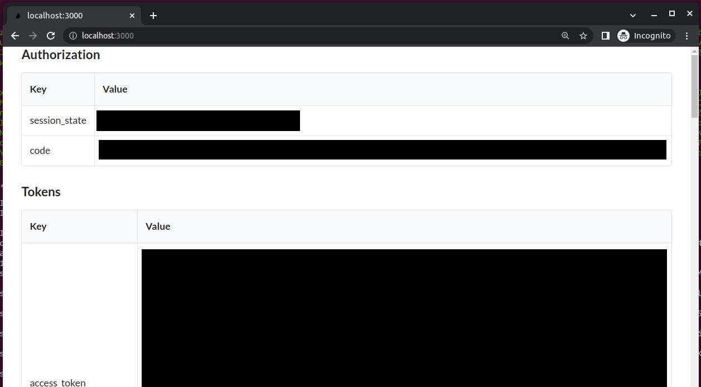

This repository contains client applications that can be used to test an integratin provided by the BC Gov CSS App

## Next-App

An example [Next.js](https://nextjs.org/) application to connect to CSS App client without 3rd party library or wrapper.back end?

- located in [examples/next-app](examples/next-app) directory.

### Creating a Keycloak integration

Before running the app locally, you will need a keycloak integration.

To use a standard keycloak realm goto the [CSS APP](https://bcgov.github.io/sso-requests) and create an integration.

During the integration creation flow you will be prompted for the inputs needed for your project. For this example project you will need a `Confidential` client type generated in the `Development` environment.

This project also requires `http://localhost:3000/oauth` as a `Redirect URI`.

### How to run

Set up the local environment:

1. Go to `examples/next-app`.
1. Copy `.env.example` to `.env`,
1. Set environment variables in `.env`.

To run locally without docker. Run the development server:

```sh
    yarn install
    yarn dev
```

To run locally with docker. Build and run the `docker-compose` file:

```sh
    docker-compose up
```

Note the docker image will not update if changes are made to the app source code. You can force a rebuild using `docker-compose up --build`

## Environment set up

The environment varibles are copied and pasted in from the installation JSON generated by the CSS app. The specific json fields to be copied over are described in the `.env.example` file.

More reading on the endpoints used by sso-keycloak can be found in the [wiki](https://github.com/bcgov/sso-keycloak/wiki/test-endpoints).

## Known issues

1. There are some intermitent issues with WSL and docker where the DNS has trouble connecting and where the authorization step can fail. (you may get a 401 error displayed on the redirect).

If debugging is failing sometimes waiting fixes the issue.

A successful login will redirect the user from the sso-keycloak sign in page back to your local url and display the login content:



## Changing OIDC providers

This app should work with any provider that uses the OIDC specs. To generalize this, the OIDC endpoint urls in the `confidential-examples/next-app/backend/config.js` file must be updated. This is becasue the endpoint url structure is not part of OIDC spec and therefore varies from provider to provider.
